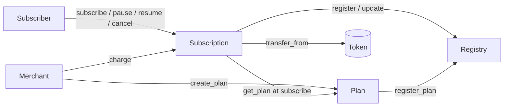

# Stellar Subscriptions Contracts

Soroban smart contracts for recurring subscription payments on Stellar —
Stripe Billing, native to Stellar.

A subscriber authorizes a spending cap and a billing interval **once**. A
merchant can then pull a fixed amount each interval, but **never more than
authorized** and **never after the subscriber cancels**.

## The security model

The subscriber grants a bounded, revocable authorization; the merchant pulls
within it. Three invariants must always hold, and each has tests that prove
it:

1. **CAP** — the total ever charged never exceeds the authorized `total_cap`.
2. **INTERVAL** — at most one charge per billing interval, even for the right
   merchant.
3. **REVOCATION** — once the subscriber cancels, no charge succeeds, ever.

Those tests were written before the implementation. A property-based fuzz
test also checks all three after every step of random charge, pause, resume
and cancel sequences. See [docs/subscription.md](docs/subscription.md) for
how each one is enforced.

## Contracts

| Contract | Path | Role |
|---|---|---|
| Subscription | [`contracts/subscription`](contracts/subscription) | Authorization, charging, pause / resume / cancel. Enforces the invariants. [Docs](docs/subscription.md) |
| Plan | [`contracts/plan`](contracts/plan) | Merchants' reusable billing terms. [Docs](docs/plan.md) |
| Registry | [`contracts/registry`](contracts/registry) | Index of plans and subscriptions with aggregate stats. [Docs](docs/registry.md) |



Only the subscriber can pause, resume or cancel. Only the merchant can charge.
The admin can link the three contracts once, before first use, and nothing
else.

## Quick start

```bash
# Prerequisites: Rust (pinned by rust-toolchain.toml) and the stellar CLI
make test        # every contract's test suite, including the invariant tests
make build       # wasm via stellar contract build
make check       # everything CI runs: test, clippy, fmt, wasm build
make deploy      # deploy + initialize + link on Testnet
```

## Layout

```
contracts/
  subscription/   core subscription + authorization logic
  plan/           merchant billing plans
  registry/       index of plans and subscriptions
docs/             per-contract reference
scripts/deploy.sh deploy, initialize and link all three
DEPLOYMENTS.md    live contract ids
```

## Deployments

Testnet contract ids are in [DEPLOYMENTS.md](DEPLOYMENTS.md).

## Sister repositories

- Web app: https://github.com/YOUR-ORG/stellar-subscriptions-web
- API + Docs: https://github.com/YOUR-ORG/stellar-subscriptions-api-docs

## Contributing

See [CONTRIBUTING.md](CONTRIBUTING.md), in particular the section on adding
features without weakening the invariants.
