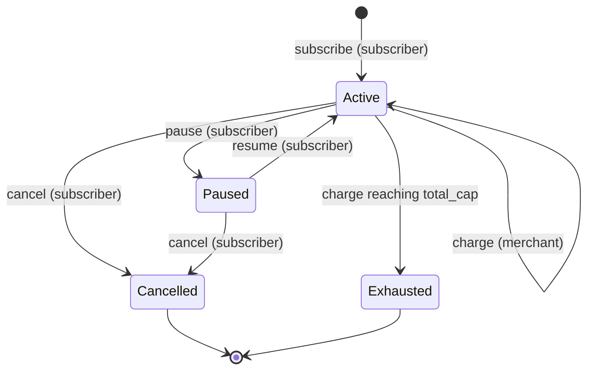

# Subscription contract

`contracts/subscription` — recurring, capped, revocable pull payments.

A subscriber authorizes a merchant **once**: a fixed amount per billing
interval, up to a total cap. The merchant then pulls each period's charge
without needing the subscriber again. The subscriber can pause, resume or
cancel at any time.

## The three invariants

Everything else in this contract exists to serve these. Each is enforced in
`charge()` before any funds move, and each has dedicated tests.

| Invariant | Rule | Enforced by | Tests |
|---|---|---|---|
| **CAP** | `total_charged` never exceeds `total_cap`. A charge that would exceed it is rejected. | `total_charged.checked_add(amount_per_period)` compared against `total_cap` | `test/invariant_cap.rs` |
| **INTERVAL** | At most one charge per interval. A charge before `next_charge_ledger` is rejected, even from the right merchant. | `now < next_charge_ledger` check; next charge scheduled from the *actual* charge ledger | `test/invariant_interval.rs` |
| **REVOCATION** | After the subscriber cancels, no charge ever succeeds again. | Only `Active` can be charged; nothing leaves `Cancelled` | `test/invariant_revocation.rs` |

`test/fuzz.rs` additionally drives random sequences of charge / pause /
resume / cancel with random time gaps and asserts all three after every step.

## Lifecycle

`Cancelled` and `Exhausted` are final. Status discriminants are part of the
interface (`Active = 0`, `Paused = 1`, `Cancelled = 2`, `Exhausted = 3`) and
are never renumbered.

## Who may call what

| Function | Signature required | Notes |
|---|---|---|
| `initialize(admin)` | admin | Once. |
| `set_plan_contract(admin, plan_contract)` | admin | Once, before the first subscription. |
| `set_registry(admin, registry)` | admin | Once, before the first subscription. |
| `subscribe(subscriber, merchant, token, amount_per_period, interval_ledgers, total_cap, plan_id) -> u64` | **subscriber** | Grants consent and approves the token allowance. |
| `charge(merchant, subscription_id)` | **merchant** | Must be the subscription's merchant. |
| `cancel(subscriber, subscription_id)` | **subscriber** | Final. Can never be blocked by the token or registry. |
| `pause(subscriber, subscription_id)` | **subscriber** | |
| `resume(subscriber, subscription_id)` | **subscriber** | |
| `refresh_allowance(subscriber, token) -> i128` | **subscriber** | Re-approves the outstanding cap with a fresh expiry. |
| `get_subscription`, `is_chargeable`, `remaining_cap`, `get_by_subscriber`, `get_by_merchant`, `get_plan_contract`, `get_registry` | none | Views. |

The admin **cannot** charge, cancel, pause or resume anything, and cannot
change a link once set.

## `charge()` in detail

Checks run in this order; the first failure returns its error and nothing
changes:

1. `merchant.require_auth()`
2. Load the subscription → `SubscriptionNotFound`
3. Caller is the subscription's merchant → `NotMerchant`
4. Status is `Active` → `SubscriptionPaused` / `SubscriptionCancelled` / `SubscriptionExhausted`
5. `now >= next_charge_ledger` → `IntervalNotElapsed`
6. `total_charged.checked_add(amount_per_period)` → `Overflow`
7. New total `<= total_cap` → `CapExceeded`

Then state is written (`total_charged`, `last_charge_ledger`,
`next_charge_ledger = now + interval_ledgers`, and `Exhausted` if the cap is
reached exactly), the token pulls `amount_per_period` subscriber → merchant
with `transfer_from`, and the registry (if linked) is updated. A refused
transfer returns `TransferFailed`; returning an error rolls back the state
write, so a failed pull never counts against the cap or the schedule.

Because the next charge is scheduled from the ledger the charge actually
happened, a merchant who charges late cannot then fire several charges in a
row to "catch up".

A cap that is not a whole number of periods is allowed: with `amount = 100`
and `cap = 250`, two charges succeed and the third is rejected with
`CapExceeded`. The subscription stays `Active` with 50 unchargeable.

## Pause and resume

Pausing blocks charges and changes nothing else. Resuming sets
`next_charge_ledger = max(next_charge_ledger, now)`:

- resumed before the next charge was due → the original schedule is kept;
- resumed after it fell due → exactly one charge is available immediately.

Paused periods are never billed, and pausing can never pull a charge earlier.

## Token allowance

A Soroban token `transfer` requires the payer's signature at call time, which
a pull payment cannot have. So `subscribe` makes the subscriber approve this
contract as a spender, and `charge` uses `transfer_from`.

The allowance is kept equal to the sum of cap still chargeable across the
subscriber's non-final subscriptions **in that token**. It is recomputed from
contract state on `subscribe`, `cancel` and `refresh_allowance`, so a second
subscription adds to the allowance instead of overwriting the first, and
cancelling releases only that subscription's share.

The allowance is defence in depth, not the enforcement: the three invariants
are enforced by the contract's own checks and hold regardless of the
allowance.

Allowances expire. The contract approves until the network's maximum entry
lifetime, measured from the start of the current ~1-day window of 17,280
ledgers. A subscription that outlives that must have `refresh_allowance`
called by its subscriber, or charges will fail with `TransferFailed` — which
changes no state, so nothing is lost.

The window alignment matters for wallets. A subscriber signs the nested
`approve` with exactly the arguments seen during simulation, and the
transaction lands a few ledgers later. If the expiry were computed from the
exact current ledger it would differ by then, the signature would not match,
and `subscribe` would pass simulation but fail on-chain (this happened on
Testnet before the fix). With alignment the expiry only changes when a window
boundary falls between simulation and submission; that rare call fails
cleanly with `ApprovalFailed` and can simply be retried.
`test/simulation_drift.rs` covers `subscribe`, `cancel` and
`refresh_allowance` signed several ledgers before they land.

## Plans

`plan_id = 0` is an ad-hoc subscription. A non-zero `plan_id` requires a
linked plan contract (`PlanContractNotSet`), an existing plan
(`PlanNotFound`) that is still active (`PlanInactive`), and exactly the plan's
merchant, token, amount and interval (`PlanMismatch`). The subscriber still
chooses their own `total_cap`.

The plan is checked only at `subscribe`. Deactivating a plan afterwards has no
effect on existing subscriptions — what the subscriber authorized governs.

## Registry

If a registry is linked, `subscribe` registers the subscription and `charge`,
`pause`, `resume` and `cancel` report its new total and status. A failed
registry call fails `subscribe`, `charge`, `pause` and `resume` (rolling them
back) so the index never silently drifts. `cancel` is the exception: it always
succeeds and reports the outcome in the event's `registry_updated` flag.

## Events

| Event | Topics | Data |
|---|---|---|
| `subscribed` | subscription_id, subscriber, merchant | token, amount_per_period, interval_ledgers, total_cap, plan_id |
| `charged` | subscription_id, merchant | amount, total_charged, next_charge_ledger, exhausted |
| `cancelled` | subscription_id, subscriber | total_charged, unused_cap, allowance_updated, registry_updated |
| `paused` | subscription_id, subscriber | ledger |
| `resumed` | subscription_id, subscriber | next_charge_ledger |

A rejected call emits nothing.

## Errors

| Code | Name | Meaning |
|---|---|---|
| 1 | `AlreadyInitialized` | |
| 2 | `NotInitialized` | |
| 3 | `Unauthorized` | Caller is not the admin. |
| 4 | `InvalidAmount` | `amount_per_period <= 0`. |
| 5 | `InvalidInterval` | `interval_ledgers == 0`. |
| 6 | `InvalidCap` | `total_cap < amount_per_period`. |
| 7 | `SameParty` | Subscriber and merchant are the same address. |
| 8 | `SubscriptionNotFound` | |
| 9 | `NotMerchant` | `charge` caller is not the subscription's merchant. |
| 10 | `NotSubscriber` | Subscriber-only action by someone else. |
| 11 | `IntervalNotElapsed` | **INTERVAL** rejection. |
| 12 | `CapExceeded` | **CAP** rejection. |
| 13 | `Overflow` | Checked arithmetic overflowed. |
| 14 | `SubscriptionCancelled` | **REVOCATION** rejection. |
| 15 | `SubscriptionPaused` | |
| 16 | `SubscriptionExhausted` | |
| 17 | `AlreadyPaused` | |
| 18 | `NotPaused` | |
| 19 | `TransferFailed` | Token refused the pull (balance or allowance). No state changed. |
| 20 | `ApprovalFailed` | Token refused the allowance. |
| 21 | `PlanNotFound` | |
| 22 | `PlanInactive` | |
| 23 | `PlanMismatch` | Terms differ from the plan's. |
| 24 | `AlreadyConfigured` | A link was already set, or a subscription already exists. |
| 25 | `PlanContractNotSet` | Non-zero `plan_id` with no plan contract linked. |
| 26 | `RegistryUpdateFailed` | |

Codes are append-only.

## Trust assumptions and limits

- **Admin** can only link contracts, once, before the first subscription. It
  cannot touch any subscription.
- **Linked registry** can affect liveness — a broken registry makes
  `subscribe`, `charge`, `pause` and `resume` fail — but never safety. It can
  never make a charge succeed that the invariants reject, and it can never
  block `cancel`.
- **Token** is chosen by the subscriber and merchant. A misbehaving token can
  make charges fail, but cannot make the contract record a charge that did not
  transfer.
- `get_by_subscriber` / `get_by_merchant` and the allowance recomputation
  iterate over every subscription that party has ever had. Parties with very
  large numbers of subscriptions should be served by an off-chain indexer
  reading the events.
